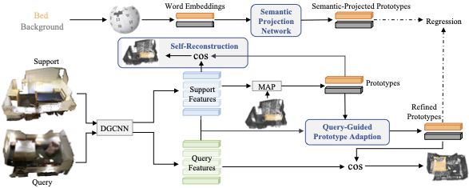

# Prototype Adaption and Projection for Few- and Zero-shot 3D Point Cloud Semantic Segmentation[[pdf](https://arxiv.org/pdf/2305.14335.pdf)]


## Overview




## Running 

**Installation and data preparation please follow [attMPTI](https://github.com/Na-Z/attMPTI).**


### Training

Pretrain the segmentor which includes feature extractor module on the available training set:

```bash
bash scripts/pretrain_segmentor.sh
```

Train our method under few-shot setting:

```bash
bash scripts/train_PAP.sh
```

Train our method  under few-and zero-shot setting:

```bash
bash scripts/train_PAPFZ.sh
```

### Evaluation

Test our method  under zero-shot setting:

```bash
bash scripts/eval_PAPFZ.sh
```

Test our method under few-shot setting:

```bash
bash scripts/eval_PAP.sh
```

Note that the above scripts are used for 2-way 1-shot on S3DIS (S^0). You can modified the corresponding hyperparameters to conduct experiments on other settings. 


## Citation
Please cite our paper if it is helpful to your research:

    @article{PAPFZS3D,
      title={Prototype Adaption and Projection for Few- and Zero-shot 3D Point Cloud Semantic Segmentation},
      author={He, Shuting and Jiang, Xudong and Jiang, Wei and Ding, Henghui},
      journal={IEEE Transactions on Image Processing},
      year={2023},
      publisher={IEEE}
    }


## Acknowledgement
We thank [DGCNN (pytorch)](https://github.com/WangYueFt/dgcnn/tree/master/pytorch) and [attMPTI](https://github.com/Na-Z/attMPTI) for sharing their source code.
